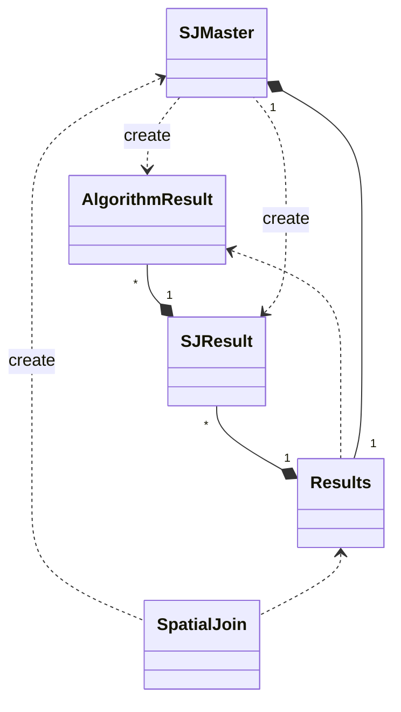

# SpatialJoin
Execute the spatial join between every couple of datasets using 4 different join algorithms.
## Usage
The program accepts 2 parameters and 5 flags:
* `-i,--input <arg>`<br/>Specify the file containing the list of datasets to use for the spatial join. 
If not specified the program will expect to find the datasets list inside the file `datasets.txt`
* `-o,--output <arg>` <br/>Specify the directory that will contain the files with the statistical information regarding the
spatial join executions. If not specified the program will use the current directory.
* `-s,--safe` Save the partial results to avoid loosing them due to
errors at run time
* `-d,--dj` Execute the spatial joins using the DJ algorithms
* `-p,--pbsm` Execute the spatial joins using the PBSM algorithm
* `-d,--dj` Execute the spatial joins using the DJ algorithm
* `-r,--repj `Execute the spatial joins using the REPJ algorithm

## Input file
The program will expect to find inside a TXT file a list of the datasets to be used both in their partitioned 
and non-partitioned version. An example of the file is reported below.
```
non_partitioned/medium_datasets/diagonal_001.csv,partitioned/medium_datasets/diagonal_001/
non_partitioned/medium_datasets/gaussian_001.csv,partitioned/medium_datasets/gaussian_001/
non_partitioned/small_datasets/diagonal_001.csv,partitioned/small_datasets/diagonal_001/
```
## Results
The results are available in a detailed way as a JSON file and in a more condensed version as a CSV file. 
### JSON
The detailed results can be found in the `results.json` file, in the main directory of the project.
The structure of the JSON file is:
```json
{
  "resultsMap": {
    "name of the two datsets": {
      "dataset1Size":,
      "dataset2Size":,
      "dataset1GridNPartitions":,
      "dataset2GridNPartitions":,
      "resultSJSize":,
      "SJResultMap": {
        "BNLJ": {
          "MBRTests":,
          "jobsTimes": [],
          "jobsTimesRelStdDev":,
          "sizeJoins": [],
          "sizeJoinsRelStdDev":
        },
        "REPJ": {
          "MBRTests":,
          "jobsTimes": [],
          "jobsTimesRelStdDev":,
          "sizeJoins": [],
          "sizeJoinsRelStdDev":
        },
        "PBSM": {
          "MBRTests":,
          "jobsTimes": [],
          "jobsTimesRelStdDev":,
          "sizeJoins": [],
          "sizeJoinsRelStdDev":
        },
        "DJ": {
          "MBRTests":,
          "jobsTimes": [],
          "jobsTimesRelStdDev":,
          "sizeJoins": [],
          "sizeJoinsRelStdDev":
        }
      }
    },
    ...
  }
}
```
### CSV
The compact results can be found in the `results.csv` file, in the main directory of the project.
The CSV file is composed of the following columns:
* dataset1
* dataset2
* dataset1Size
* dataset2Size
* dataset1GridNPartitions
* dataset2GridNPartitions
* resultSJSize
* BNLJMBRTests
* BNLJjobsTimes
* BNLJjobsTimesRelStdDev
* BNLJsizeJoins
* BNLJsizeJoinsRelStdDev
* PBSMMBRTests
* PBSMjobsTimes
* PBSMjobsTimesRelStdDev
* PBSMsizeJoins
* PBSMsizeJoinsRelStdDev
* DJMBRTests
* DJjobsTimes
* DJjobsTimesRelStdDev
* DJsizeJoins
* DJsizeJoinsRelStdDev
* REPJMBRTests,
* REPJjobsTimes
* REPJjobsTimesRelStdDev
* REPJsizeJoins
* REPJsizeJoinsRelStdDev

The times of the jobs and the size of the joins for each spatial join algorithm are obtained summing respectively all 
the distinct times of the jobs and the distinct size of the joins. 

## Spatial Join Algorithm
The four algorithms used are:
* **BNLJ** It's used with the non-partitioned version of the two datasets.
* **PBMS** It's used with the non-partitioned version of the two datasets.
* **DJ** It's used with the partitioned version of the two datasets.
* **REPJ** It's used with the largest dataset partitioned and with the smaller one not-partitioned.

To fasten up the process it is possible to specify which algorithm will be used for the spatial join using the four flags `-b,-p,-d,-r`.
If no flags is provided, the execution will use all 4 of them.


## ClassDiagram
[](https://mermaid.live/edit#eyJjb2RlIjoiY2xhc3NEaWFncmFtXG5TSk1hc3RlciA8Li4gU3BhdGlhbEpvaW4gOiBjcmVhdGVcblJlc3VsdHMgPC4uIFNwYXRpYWxKb2luXG5SZXN1bHRzIFwiMVwiIC0tKiBcIjFcIiBTSk1hc3RlciBcblNKUmVzdWx0IFwiKlwiIC0tKiBcIjFcIiBSZXN1bHRzIFxuU0pSZXN1bHQgPC4uIFNKTWFzdGVyIDogY3JlYXRlXG5BbGdvcml0aG1SZXN1bHQgXCIqXCIgLS0qIFwiMVwiIFNKUmVzdWx0XG5BbGdvcml0aG1SZXN1bHQgPC4uIFJlc3VsdHNcblNKTWFzdGVyIC4uPiBBbGdvcml0aG1SZXN1bHQgOiBjcmVhdGUiLCJtZXJtYWlkIjoie1xuICBcInRoZW1lXCI6IFwiZGVmYXVsdFwiXG59IiwidXBkYXRlRWRpdG9yIjpmYWxzZSwiYXV0b1N5bmMiOnRydWUsInVwZGF0ZURpYWdyYW0iOmZhbHNlfQ)
<!--

-->

* **SpatialJoin** is the main class. Its job is to prepare the environment and create the SJMaster.
* **SJMaster** is the core of the software. It loads the datasets and execute the joins.
* **Results, SJResult** and **AlgorithmResult** are object used to store the information about the execution
of the spatial joins, and they contain respectively the global information, the info about the four type of algorithms on 
a single couple of datasets and the information about a single join execution on a single couple of datasets.